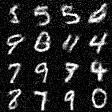

# mnist-gan

Naive [Generative Adversarial Network (GAN)](https://en.wikipedia.org/wiki/Generative_adversarial_network) implementation able to generate images of digits from the [MNIST digit dataset](https://en.wikipedia.org/wiki/MNIST_database) using fully connected layers. Implemented using the Rust [dfdx crate](https://crates.io/crates/dfdx).

## Training Data

Input data is expected in the following file structure:
```
├──mnist-gan
│  ├──data
│  │  ├──training
│  │  │  ├──0
│  │  │  │  ├──digit_0_0.jpg
│  │  │  │  ├──digit_0_1.jpg
│  │  │  ├──1
│  │  │  │  ├──digit_1_0.jpg
│  │  │  │  ├──digit_1_1.jpg
│  │  │  ├──2
│  │  │  │  ├──digit_2_0.jpg
│  │  │  │  ├──digit_2_1.jpg
...
```
File names don't matter. All files within the folders will be considered for training. [This source](https://www.kaggle.com/datasets/jidhumohan/mnist-png) offers the data in such structure.

## Results

After 500,000 iterations the network is able to produce results like this:

